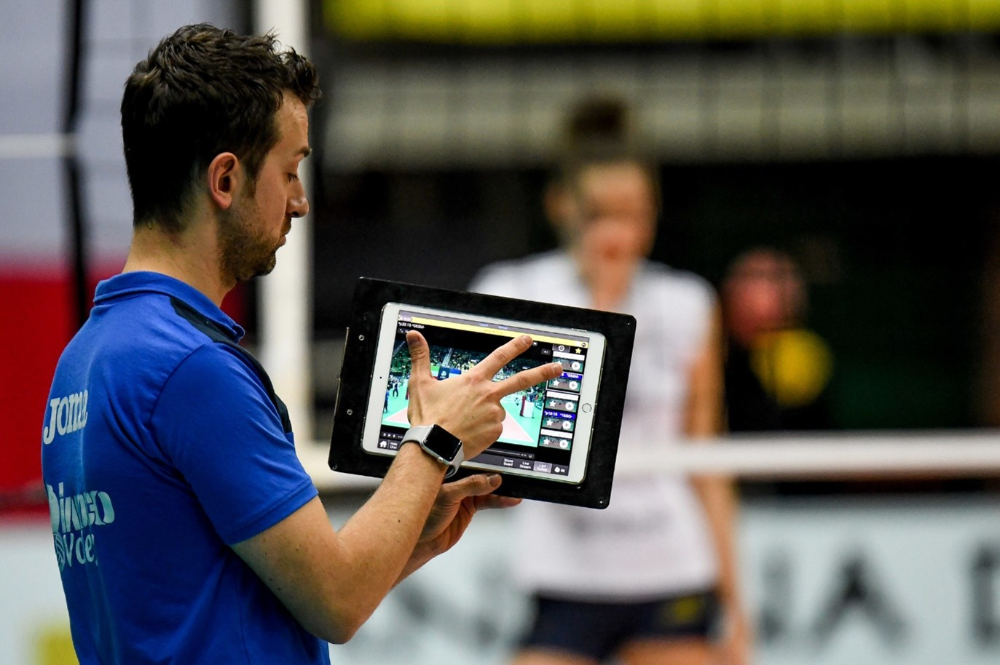
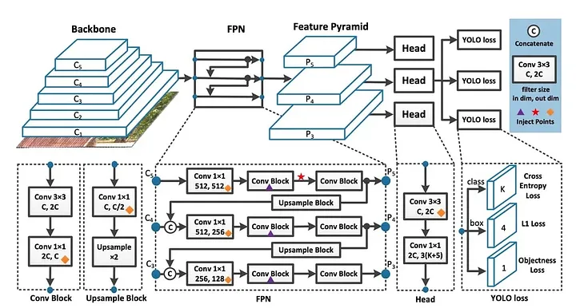

<h1 align="center">
    Volleyball Analytics
</h1>
<h1 align="center">
    
</h1>

[image source](https://sportsedtv.com/blog/what-to-pack-on-a-volleyball-trip-volleyball)


# Introduction to Sports Analytics
The use of Artificial Intelligence (AI) in sports analytics has become 
increasingly prevalent, offering teams and athletes valuable insights 
to enhance performance, strategy, and decision-making.

**Video analysis** is a crucial component of sports analytics, individually in volleyball.
It involves the use of video footage of games or training sessions to 
gather detailed insights into player and team performance, identify strengths and 
weaknesses, and make informed decisions to improve overall efficiency and effectiveness 
on the court.
This can be useful in many aspects:

#### Real-Time Feedback
Some advanced video analysis tools provide real-time feedback during matches or training sessions. 
Coaches can use this information to make immediate adjustments to tactics, substitutions, or 
strategies based on the ongoing performance.

#### Scouting Opponents
Teams use video analysis to scout upcoming opponents. By studying their playing style, key players, 
and preferred strategies, teams can prepare more effectively for upcoming matches.

#### Performance Evaluation
Coaches and analysts can review match footage to evaluate player techniques, strategies, and 
overall performance. This includes aspects such as serving, passing, setting, attacking, and 
defensive plays.

#### Statistical Tracking
Video analysis software often integrates with statistical tracking systems. This enables the 
extraction of key performance metrics, such as hitting percentages, passing accuracy, and 
blocking effectiveness, directly from the video footage.

#### Injury Prevention
Video analysis can help identify movement patterns and techniques that may contribute to 
injuries. Coaches and sports scientists can use this information to design training programs 
focused on injury prevention and optimize players' biomechanics.

#### Decision Review System
Video analysis can assist the referee by reviewing decisions using video footage. This technology can be 
utilized in several occasions in volleyball. For example, Hawk eye technology can check if the ball bounced 
inside the court or not. Something like this:


Overall, video analysis plays a pivotal role in enhancing coaching strategies, player development, and 
team performance in volleyball and many other sports. The combination of video footage and analytics 
provides a comprehensive understanding of the game, enabling teams to make data-driven decisions for 
success.

# About Project
This machine learning project runs in real-time on top of 2 deep learning models.

#### Video Classification model: 
In a live broadcast game, it is important to run processes only when game is on. To extract the periods that 
game is on, [HuggingFace VideoMAE](https://huggingface.co/docs/transformers/en/tasks/video_classification) 
is utilized. This model is trained on a custom dataset that consists of 3 labels **service**, **play**, 
**no-play**. This model gets 30 frames as input, and outputs the label. it's **service**, **play**, **no-play**.
  - **service** indicates the start of the play when a player tosses the ball to serve it.
  - **play** indicates the periods of game where the players are playing and the game is on.
  - **no-play** indicates the periods of the game where the players are not playing.

This is the VideoMAE architecture.


[image source](https://huggingface.co/docs/transformers/model_doc/videomae)
#### Yolov8 model: 
This state-of-the-art model is an object detection model that is trained on a dataset which includes 
   several objects along with several volleyball actions.

This is yolov8 architecture:


[image source](https://medium.com/@syedzahidali969/principles-of-yolov8-6a90564e16c3)

The yolov8n is chosen for fine-tuning on 6 different objects (actions). In demos,
you can see 6 colors for bounding boxes. 
- Red box: volleyball ball
- Brown box: volleyball service action
- Green box: volleyball reception action.
- Blue box: volleyball setting action.
- Purple box: volleyball blocking action.
- Orange box: volleyball spike action.

These are the outputs indicating the video classification + object detection results. 
The video classification model results can be seen in the top-left corner of video, and the object detection 
results can be seen as bounding boxes with mentioned colors. please note that the object detection is running
on the frames that are labeled as **SERVICE** and **PLAY**.

### Demo 1: FRANCE - POLAND

### Demo 2: USA - CANADA

### Demo 3: USA - POLAND


The third step is to use the generated data to find insights about the game. 
for example, in the below gif, one of the ace points is extracted. 

### Demo 4: FRANCE - POLAND Ace score.


Development
---------
The whole project is developed with python 3.11. The requirements can be
found in `requirements.txt`.

There are several scripts that can run the models and output demos that are listed here:

- `src/demo.py`: It uses both video classification + yolo in the inference code and 
    outputs the demos just like the ones shared here.
- `src/VideoMAE_inference.py`: Only runs inference with video classification.
- `src/yolo_inferece.py`: Runs inference with yolo-v8 object detection.

If you want to store the results in database, you must satisfy some dependencies:

- Install Postgresql.
- Create a yaml file on `conf` directory named `db_conf.yaml`, and put these values on it.

```
development:
  user: "user"
  password: "*********"
  db: "volleyball_development"
  host: "some_ip"
  port: 5432
  dialect: 'postgresql'
  driver: 'psycopg2'
test:
  user: "user2"
  password: "********"
  db: "volleyball_test"
  host: "some_ip"
  port: 5432
  dialect: 'postgresql'
  driver: 'psycopg2'
```
- install PostgreSQL based on [this link tutorials](https://www.cherryservers.com/blog/how-to-install-and-setup-postgresql-server-on-ubuntu-20-04)
- Create a `.env` file like `conf/sample.env`, and copy and paste its path to `src/backend/app/core/config.py` in line 28.

these are sample values in the `.env` file:    
```
MODE=development or test
DEV_USERNAME=user1
DEV_PASSWORD=********
DEV_HOST=localhost
DEV_DB=volleyball_development
DEV_PORT=5432
DEV_DRIVER=postgresql
TEST_DB_URL=sqlite:///./vb.db
```
 
- `make install` to install dependencies.
- `make test` to run unittest tests for backend APIs.
- `uvicorn src.backend.app.app:app` to start the APIs.
- Then to seed the database with initial data, run `src/api_init_data.py`.
- run `src/main.py` and check out the database to see the results.

# About data 
The video clips that are gathered as data are from 
[this YouTube channel](https://www.youtube.com/@VolleyballWatchdog/videos).

## What comes next:
1. Data Analysis is going to be added to the code. There are various KPIs that can be
 measured based on objects detected, like service success rate, service zone analysis, 
  reception success rate, etc ...
2. Publishing the datasets for video classification and volleyball object detection.
