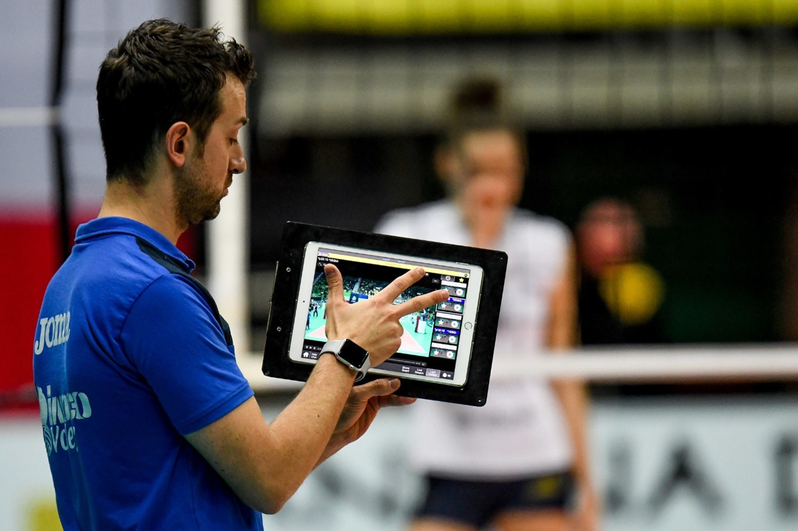
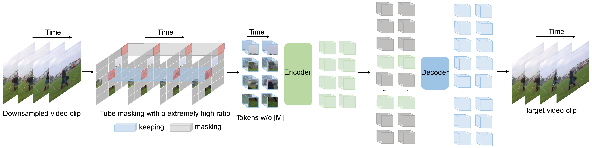
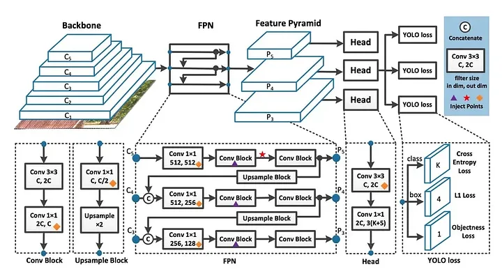

<h1 align="center">
    🏐 Volleyball Analytics
</h1>
<h1 align="center">
    
</h1>

[image source](https://sportsedtv.com/blog/what-to-pack-on-a-volleyball-trip-volleyball)

## 📌 Overview

**Volleyball Analytics** is an end-to-end computer vision project that turns volleyball match video into structured, queryable information—so you can move from “watching footage” to **measuring what happened**. It’s built for practical, real-time workflows where coaches, analysts, and developers want automated tagging, breakdowns, and visual overlays from broadcast-style games.

At its core, the system combines **game-state understanding** (SERVICE / PLAY / NO-PLAY) with **action and object detection** (serve/receive/set/spike/block + ball) and **court segmentation**. These signals can be streamed into a live demo, exported as annotated video, and used as building blocks for higher-level KPIs (e.g., rally segmentation, action counts, and moment extraction like ace points).

The project also includes a **FastAPI backend** (optional) for storing and retrieving results, making it easier to integrate this pipeline into larger applications (dashboards, scouting tools, or data pipelines). The machine learning functionality is organized through a unified **ML Manager** module (included as a git submodule) to keep training/inference components reusable and cleanly separated.

## 🚀 Quick Start

### 📥 1. Clone the Repository including its submodules.

This repository uses **Git submodules** for the ML Manager. You must clone it correctly:

```bash
# Clone with submodules (RECOMMENDED)
git clone --recursive https://github.com/masouduut94/volleyball_analytics.git

# OR if already cloned, initialize submodules
git submodule update --init --recursive
```

### 🐍 2. Create the Python Environment

You can set up the project using either **uv** (recommended for speed) or **Conda**.

#### ⚡ Option A: Using uv

Install dependencies directly from the `pyproject.toml` file:

```bash
# Create and sync the virtual environment
uv sync

# Activate the environment
source .venv/bin/activate      # Linux / macOS
.venv\Scripts\activate         # Windows
```

#### 🐍 Option B: Using Conda

Create the environment from the provided `requirements.yml` file:

```bash
# Create the conda environment
conda env create -f requirements.yml

# Activate the environment
conda activate volleyball_analytics
```

### 🧪 3. Validate the Installation

To verify that the environment and models are set up correctly, run the `setup.ipynb` notebook located in the `notebooks/` directory.

Before launching Jupyter Notebook, make sure your environment is available as a Jupyter kernel.

#### :memo: Register the Environment as a Jupyter Kernel

If using **uv**:

```bash
python -m ipykernel install --user --name volleyball_analytics --display-name "Python (volleyball_analytics)"
```

If using **Conda**, activate the environment first and then run:

```bash
python -m ipykernel install --user --name volleyball_analytics --display-name "Python (volleyball_analytics)"
```

#### 🚀 Launch Jupyter

```bash
jupyter notebook
```

Open:

```text
notebooks/setup.ipynb
```

and select the **Python (volleyball_analytics)** kernel before running the notebook.

The notebook will download any required assets (if needed) and validate that the models and dependencies are installed correctly. ✅


### 🎯 Model Weights Setup and test individually.

The system requires pre-trained models for inference. **Weights are automatically downloaded** when you first run the system, or you can download them manually.

#### 🚀 Automatic Download (Recommended)
```python
from src.ml_manager import MLManager

# Weights are automatically downloaded if missing
manager = MLManager()
```

#### 📥 Manual Download
```python
from src.ml_manager.utils.downloader import download_all_models

# Download all models in one ZIP file
success = download_all_models()
```

### 🧠 Model weights URLs

1. [Court segmentation](https://drive.google.com/file/d/1bShZ7hxNw_AESEgKf_EyoBXdFqCuL7V-/view?usp=drive_link)
2. [Ball segmentation](https://drive.google.com/file/d/1KXDunsC1ALOObb303n9j6HHO7Bxz1HR_/view?usp=drive_link)
3. [Action detection](https://drive.google.com/file/d/1o-KpRVBbjrGbqlT8tOjFv91YS8LIJZw2/view?usp=drive_link)
4. [Gamestate classification](https://drive.google.com/file/d/18vtJSLIpaRHOlvXNmwvSd9stYYAEsMcK/view?usp=drive_link) 

### 🛢️ Dataset URLs

1. [Ball segmentation](https://drive.google.com/file/d/1Xb4P7s9NmSNkeAIY4a9dkznsoVKfwCCg/view?usp=drive_link)
2. [Action detection](https://drive.google.com/file/d/10el9KW4MW-vLNf8sPJvlHjIfAIMgwnlX/view?usp=drive_link)
3. [Gamestate classification](https://drive.google.com/file/d/1bhGTMQUIUPYMlwhNS4z6DwsnMaGKIBpn/view?usp=drive_link)


#### 📁 Final Directory Structure
```
weights/
├── 🏐 ball/weights/best.pt           # Ball detection & segmentation
├── 🎭 action/weights/best.pt         # Action detection (6 classes)  
├── 🏟️ court/weights/best.pt          # Court segmentation
└── 🎮 game_state/                    # Game state classification
    └── [checkpoint files]
```

**Download Source**: [Complete Weights ZIP](https://drive.google.com/file/d/1__zkTmGwZo2z0EgbJvC14I_3kOpgQx3o/view)

### 🎯 ML Manager Integration

The system uses a unified **ML Manager** module for all machine learning operations:

```python
from src.ml_manager import MLManager
import cv2
# Initialize ML Manager
ml_manager = MLManager(verbose=True)

cap = cv2.VideoCapture('sample_video.mp4')
frames = []
for i in range(16):
    status, frame = cap.read()
    frames.append(frame)
# Game state classification
game_state = ml_manager.classify_game_state(frames)

# Action detection
actions = ml_manager.detect_actions(frames[0])

# Ball detection
ball_detections = ml_manager.detect_ball(frames[0])
```

**📚 ML Manager Documentation**: See [src/ml_manager/README.md](src/ml_manager/README.md) for comprehensive usage.


### 🎯 What You'll Get

- **🏐 ML Pipeline**: Video classification + Object detection for volleyball analysis
- **🎮 Game State Classification**: Service, Play, No-Play detection using VideoMAE
- **🎭 Action Detection**: 6 volleyball actions (serve, receive, set, spike, block, ball)
- **🏟️ Court Segmentation**: Court boundary detection
- **📊 Analytics**: Real-time statistics and insights
- **🌐 API Backend**: FastAPI-based backend for data storage and retrieval

## 🏗️ Project Architecture

This machine learning project runs in real-time on top of **2 deep learning models**:

### 🎬 Video Classification Model (VideoMAE)
In a live broadcast game, it's important to run processes only when the game is on. To extract the periods when the game is active, [HuggingFace VideoMAE](https://huggingface.co/docs/transformers/en/tasks/video_classification) is utilized.

**🎯 Purpose**: Game state classification with 3 labels
- **🏐 SERVICE**: Start of play when a player tosses the ball to serve
- **🎮 PLAY**: Active game periods where players are playing
- **⏸️ NO-PLAY**: Inactive periods where players are not playing

**🏗️ Architecture**: 


[image source](https://huggingface.co/docs/transformers/model_doc/videomae)

### 🎯 YOLOv8 Object Detection Model
This state-of-the-art model is trained on a custom volleyball dataset for object detection and action recognition.

**🏗️ Architecture**: 


[image source](https://medium.com/@syedzahidali969/principles-of-yolov8-6a90564e16c3)

**🎨 Detection Classes** (6 different objects with color-coded bounding boxes):
- 🔴 **Red box**: Volleyball ball
- 🟤 **Brown box**: Volleyball service action
- 🟢 **Green box**: Volleyball reception action
- 🔵 **Blue box**: Volleyball setting action
- 🟣 **Purple box**: Volleyball blocking action
- 🟠 **Orange box**: Volleyball spike action

## 🎥 Demo Results

The system provides real-time analysis with:
- **🎮 Game State**: Displayed in top-left corner (SERVICE/PLAY/NO-PLAY)
- **🎯 Object Detection**: Color-coded bounding boxes (only on SERVICE and PLAY frames)
- **📊 Analytics**: Real-time statistics and insights

### 🏆 Demo Videos

#### 🇫🇷 France vs 🇵🇱 Poland


#### 🇺🇸 USA vs 🇨🇦 Canada


#### 🇺🇸 USA vs 🇵🇱 Poland


### 🎯 Ace Point Detection
The system can extract specific game moments, like ace points:


### 🎯 Individual Model Testing

Test specific components individually:

```bash
# Basic inference test using demo.py
python src/demo.py --video_path path/to/your/video.mp4

```

## 📊 Data Sources

The video clips used for training and testing are sourced from:
- **📺 YouTube Channel**: [Volleyball Watchdog](https://www.youtube.com/@VolleyballWatchdog/videos)
- **🏆 Content**: International volleyball matches and tournaments

## 🔮 Future Development

### 📈 Planned Features
1. **📊 Data Analysis**: Advanced KPIs and analytics
   - Service success rate analysis
   - Service zone analysis
   - Reception success rate
   - Player performance metrics
   - Team strategy analysis

2. **🎯 Real-time Analytics**: Live match analysis
   - Real-time statistics
   - Live performance metrics
   - Instant insights for coaches

## 🏗️ Project Structure

```
volleyball_analytics/
├── 🧠 src/                         # Main source code
│   ├── 📁 ml_manager/               # ML Manager submodule
│   ├── 📁 vb_backend/                # FastAPI backend
│   ├── 📁 weights/                   # Model weights
│   ├── 🎬 main.py                    # Main ML pipeline (coming soon!)
│   ├── 🎥 demo.py                   # Demo application
├── 📊 data/                         # Datasets and processed data
├── 📚 notebooks/                    # Jupyter notebooks
├── 🛠️ scripts/                     # Utility scripts
├── 📋 conf/                         # Configuration files
└── 📖 README.md                     # This file
```


## 🔗 Additional Resources

- **📚 Wiki**: [Datasets and Weights](https://github.com/masouduut94/volleyball_analytics/wiki/Datasets-and-Weights)
- **🌐 API Documentation**: [API Guide](https://github.com/masouduut94/volleyball_analytics/wiki/API)
- **🎮 ML Manager**: [Comprehensive Documentation](src/ml_manager/README.md)
- **📊 Examples**: [Usage Examples](src/ml_manager/example_usage.py)
- **🎮 Other datasets**: [Volleyball Spatiotemporal event spotting](https://hoangqnguyen.github.io/stes/)

---

**🏐 Happy Volleyball Analytics! Let's revolutionize the game with AI! 🚀✨**
